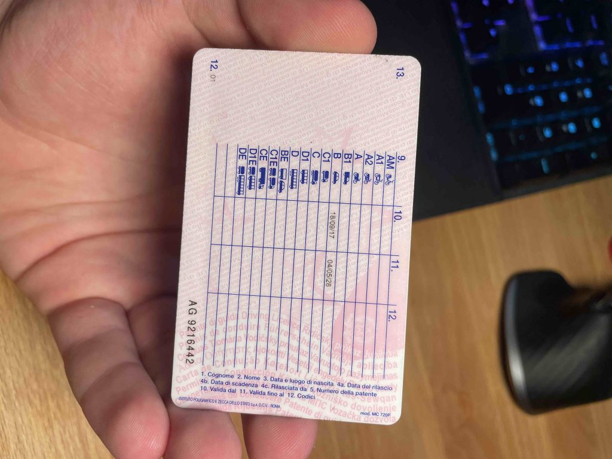
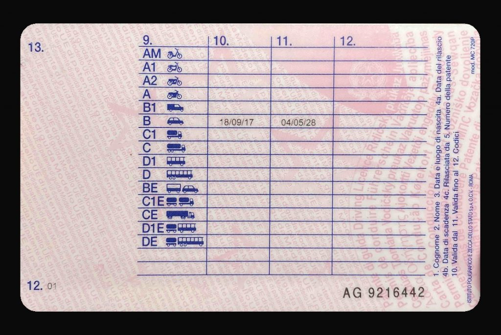
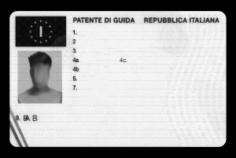
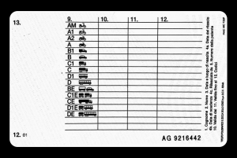
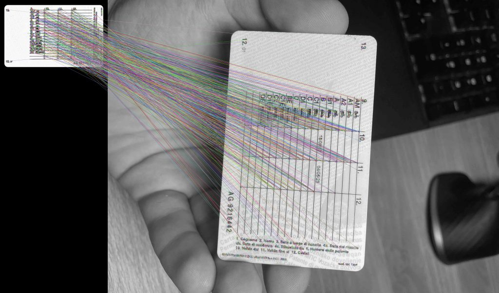
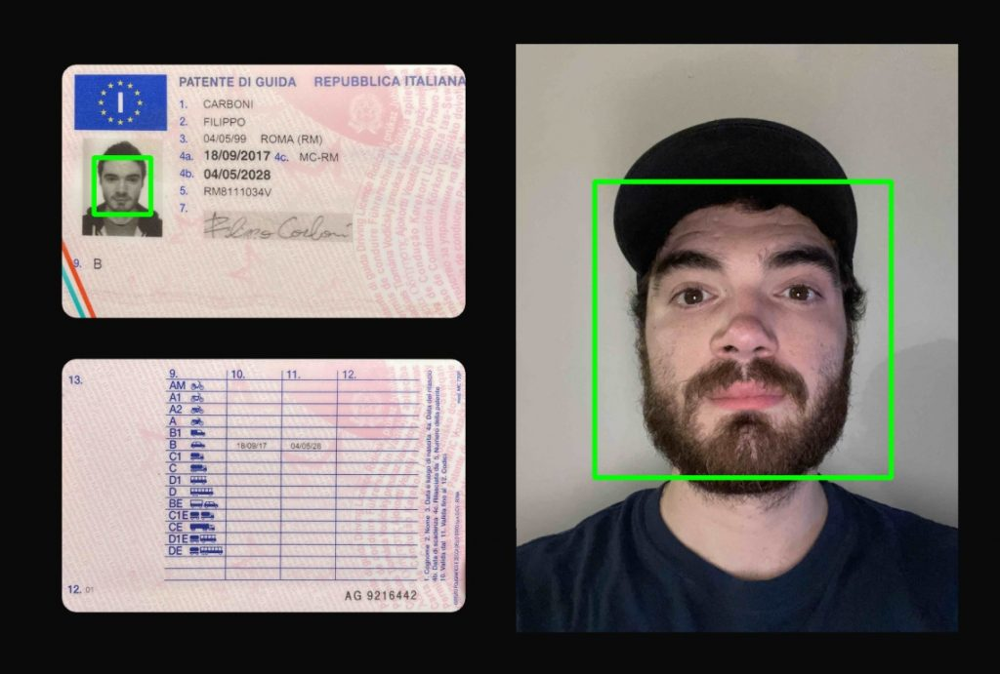

## Il problema

L'idea di questo progetto nasce da un'esigenza reale riscontrata sul lavoro.

In particolare il servizio in questione richiede agli utenti di inserire le foto della propria patente e un selfie.  
I dati raccolti devono poi essere analizzati da una persona che prenderà la decisione di confermarli registrando i dati di interesse:

- Tipo di patente
- Scadenza

o scarterà le immagini poiché non attinenti, non leggibili o per non corrispondenza tra documento, selfie e/o dati anagrafici precedentemente inseriti.

## Obiettivo del progetto

Il programma in oggetto prende in input 3 immagini:

- Foto del fronte della patente
- Foto del retro della patente
- Selfie dell'utente (possibilmente con patente in mano)

Come anticipato l'obiettivo finale è quello di realizzare un programma che sia in grado di agevolare, e a tendere sostituire, il lavoro di analisi della validità del documento e di raccolta delle informazioni.

Al fine di affrontare la sfida in modo ordinato ho suddiviso il problema in step più semplici di seguito elencati e successivamente descritti:

- Preprocessing delle immagini in input
- Face match tra selfie e documento con stima del match

## 1\. Preprocessing delle imagini in input

In questa fase lo scopo è quello di prendere in input le foto di fronte e retro del documento così come il cliente del servizio le ha caricate. Sebbene sarebbe auspicabile avere già delle immagini chiaramente leggibili e di facile lettura, nella realtà dei fatti ci troviamo di fronte a immagini che sono spesso ruotate, distorte in prospettiva o incorniciate dall'ambiente di cui, per le finalità che ho descritto, ci interessa poco e niente.

Una volta caricato l'input cerchiamo di riportare le immagini in un output standard che incornici chiaramente il documento, ruotandolo correttamente e riportandolo, per quanto possibile, nella prospettiva corretta.

Un'esempio del risultato atteso è il seguente:



Immagine in input



Risultato atteso

La scelta implementativa su cui ho puntato per affrontare questo primo passo è stata quella di affidarmi all'omografia.

L'idea è quella di sfruttare gli elementi grafici che si ripetono su tutte le patenti Italiane o europee per andare a identificare le corrispondenze tra i punti rilevati sull'immagine in input e quelli rilevati su un'immagine precedentemente disposta come template per il confronto.

Sull'immagine del template sono state rimosse eventuali informazioni poco significative e sono stati lasciati gli elementi che maggiormente si ripetono sui file in input.

Per trattare i passi successivi risulta più semplice accompagnare la descrizione con il codice, in particolare vedremo codice Python, gli algoritmi e le librerie utilizzate possono per essere riprodotte con altri linguaggi, ad esempio C++.

Importiamo le librerie che ci serviranno nel progetto.

```
import os
import cv2
import numpy as np
import scipy
import face_recognition # To match faces
import shutil # To delete folder
```

Definisco una lista di nomi di cartelle da cui caricare i file in input.

```
INPUT_SET = ["01", "02", "03", "04", "05", "06", "A1", "B2", "C3", "D4", "E5"]
```

In ogni cartella mi aspetto che ci siano i seguenti file:

- doc\_fronte.jpeg
- doc\_retro.jpeg
- doc\_selfie.jpeg

A partire da INPUT\_SET eseguiamo un ciclo su ogni elemento.

  
Prima di iniziare l'esecuzione dello script utilizzo la libreria shtuil per rimuovere la cartella di output "/results" e tutto il suo contenuto.  
ignore\_errors deve essere settato a True per ignorare gli errori che il sistema manda nel tentativo di rimuovere una cartella non vuota.

```
shutil.rmtree('results', ignore_errors=True)
```

Inizio il ciclo, per ogni cartella di input ne creo, se non esiste, una di output con lo stesso nome:

```
for user in INPUT_SET:
 
    # Folder name
    folder_name = str(user)+"/"
    
    # create target folder if not exists
    saving_url = "results/"+folder_name
    if not os.path.exists(saving_url):
        os.makedirs(saving_url)
```

Il prossimo passaggio è quello di chiamare la funzione _get\_wrapped\_image_, la quale preso in input il percorso dove trovare un immagine restituisce l'elaborazione della stessa estrapolando solo i dati di interesse che racchiudono il documento in un'immagine.

Vediamo ora nel dettaglio la funzione

## def get\_wrapped\_image(filename, template)

```
    # Load the template picture
    template = cv2.imread(template)
    url = "data/" + filename + ".jpeg"
    # Load test picture
    original_test = cv2.imread(url)
```

Utilizzo la libreria opencv per caricare la risorsa grafica del template e la risorsa di input da confrontare.

Il template è disponibile nella cartella "/template" anche come file .PSD per generare eventuali altri template.  
Il template preso in esame è per documenti europei e in particolare italiani. Una successiva implementazione potrebbe performare una classificazione per paesi di appartenenza per poi applicare il template corretto.



Front template



Back template

Caricata l'immagine in input procediamo con il resize dell'immagine e l'aggiunta di un bordo all'immagine (che può aiutare nei casi di foto molto ravvicinate e incomplete del documento), poi procediamo con la conversione dell'immagine in scala di grigi.

Ci avvaliamo quindi delle seguenti 2 funzioni ausiliarie.

```
    # Resize test picture
    test = original_test = resize_with_aspect_ratio_and_add_border(original_test, height=None)
    # Convert picture to gray scale color palette
    test = rgb_to_gray_scale(test)
```

La conversione in scala di grigi permette alla libreria di trovare i keypoint nell'immagine. Ho deciso di utilizzare per comodità il metodo cvtColor di opencv piuttosto che implementare l'algoritmo di conversione.

```
def convert_to_gray_scale(image):
    return cv2.cvtColor(image, cv2.COLOR_BGR2GRAY)
```

Di seguito la definizione della funzione di ridimensionamento. Il colore dello sfondo del padding attorno all'immagine è deciso dalla costante:

```

BACKGROUND_COLOR = (10, 10, 10)
```

```
def resize_with_aspect_ratio_and_add_border(image, width=None, height=None, inter=cv2.INTER_AREA):
    dim = None
    (h, w) = image.shape[:2]

    if width is None and height is None:
        return image
    if width is None:
        r = height / float(h)
        dim = (int(w * r), height)
    else:
        r = width / float(w)
        dim = (width, int(h * r))

    resized_img = cv2.resize(image, dim, interpolation=inter)

    # Create an empty black_img and centering the resized
    w = dim[0] + PADDING_PIXELS * 2
    h = dim[1] + PADDING_PIXELS * 2

    blank_image = np.zeros((h, w, 3), np.uint8)

    for y in range(h):
        for x in range(w):

            x2 = x - PADDING_PIXELS
            y2 = y - PADDING_PIXELS

            if x2 < 0 or x2 >= dim[0]:
                x2 = None

            if y2 < 0 or y2 >= dim[1]:
                y2 = None

            if x2 is None or y2 is None:
                rgb_pixel = BACKGROUND_COLOR
            else:
                rgb_pixel = resized_img[y2 - 1][x2 - 1]

            blank_image[y, x] = rgb_pixel


    return blank_image
```

Per effettuare il ridimensionamento utilizzo il metodo resize di OpenCV mantenendo l'aspect ratio dell'immagine.

Procedendo con la funzione get\_wrapped\_image, il passaggio successivo è trarre i keypoints dalle singole immagini convertite in scala di grigi. MAX\_FEATURES definisce il numero massimo di keypoint da trovare sull'immagine.

```
    # Chose keypoints detection method
    orb = cv2.ORB_create(MAX_FEATURES)
    keypoints1, descriptors1 = orb.detectAndCompute(template, None)
    keypoints2, descriptors2 = orb.detectAndCompute(test, None)
```

Eseguo il metodo di rilevazione dei match tra i keypoint rilevati sul template e quelli rilevati sull'immagine di test.

Ordino poi i match in base alla distanza, tronco l'array in modo da tenere la percentuale GOOD\_MATCH\_PERCENT come asset di valori validi.

```
    # FIRST ALGORYTHM
    # Sort matches by score
    matches.sort(key=lambda x: x.distance, reverse=False)
    # Calculate how many matches to keep
    numGoodMatches = int(len(matches) * GOOD_MATCH_PERCENT)
    matches = matches[:numGoodMatches]  # Remove not so good matches
```

Applico un ulteriore filtro per eliminare i match con distanza eccessiva, ovvero maggiore di MAX\_KEYPOINT\_DISTANCE.

```
    newMatches = list()
    for match in matches:
        if (match.distance > MAX_KEYPOINT_DISTANCE):
            break
        # print("Distance:", match.distance)
        newMatches.append(match)
```

Eseguo quindi il codice per effettuare effettivamente la trasformazione dell'immagine:



Visualizzazione grafica dei match tra test e template

```
    # Save the matching image for debug
    imMatches = cv2.drawMatches(template, keypoints1, test, keypoints2, newMatches, None)
    saving_url = "results/"+filename+"_matching.jpg"
    cv2.imwrite(saving_url, imMatches)

    template = cv2.drawKeypoints(template, keypoints1, None)
    test = cv2.drawKeypoints(test, keypoints2, None)

    # Extract location of good matches
    points1 = np.zeros((len(matches), 2), dtype=np.float32)
    points2 = np.zeros((len(matches), 2), dtype=np.float32)

    for i, match in enumerate(matches):
        points1[i, :] = keypoints2[match.trainIdx].pt
        points2[i, :] = keypoints1[match.queryIdx].pt

    # Find homography
    h, mask = cv2.findHomography(points1, points2, cv2.RANSAC)

    # Use homography
    height, width, channels = template.shape
    im2Reg = cv2.warpPerspective(original_test, h, (width, height))
```

Applico una maschera all'immagine trasformata per eliminare lo sfondo indesiderato, il colore dello sfondo è sempre dato da BACKGROUND\_COLOR. Ritorno poi l'immagine elaborata.

```
    # Loading Mask
    mask = cv2.imread("template/mask.png")  # Load the template picture
    mask = rgb_to_gray_scale(mask)

    # Applying Mask Template pixel per pixel
    (h, w) = im2Reg.shape[:2]
    for y in range(h):
        for x in range(w):
            v = mask[y - 1][x - 1]
            if v < 200:
                im2Reg[y - 1][x - 1] = BACKGROUND_COLOR

    saving_url = "./results/" + filename + ".jpg"

    return im2Reg
```

## Tornando al ciclo principale

```
 # WRAP DOCUMENT PICTURES
    # Generate Wrapped Front image
    front = get_wrapped_image(filename=folder_name+"doc_fronte", template="template/template-empty-front.png")
    # Generate Wrapped Back Image
    back = get_wrapped_image(filename=folder_name+"doc_retro", template="template/template-empty-back.png")
```

Elaborati fronte e retro inizio a preparare l'immagine per l'esportazione unendo verticalmente le immagini di fronte e retro elaborate.

```
    # PREPARE FIRST PART OF OUTPUT IMAGE
    # Stacking vertically the 2 pictures
    collage = np.vstack((front, back))
    # Standardize the image to match the collage heigth
    collage = resize_with_aspect_ratio_and_add_border(collage, height=MAX_PICTURE_HEIGHT)
```

Voglio unire anche il selfie al "collage" finale. Prima di unirlo orizzontalmente chiamo la funzione rotate\_selfie per ruotarlo in modo che il volto, se presente, si trovi nell'orientazione corretta.

```
# Rotate selfie picture detecting face
def rotate_selfie(selfie):
    # Function performs selfie rotation until a face is found, then break and return the turned picture
    for i in range(1, 5):
        # Convert selfie in gray scale
        selfie_gray = rgb_to_gray_scale(selfie)
        # Looking for a face in the picture
        selfie_faces = FACE_CASCADE.detectMultiScale(selfie_gray, 1.35, 8)
        # Draw rectangle around the faces
        # Check if at least one face was found
        if len(selfie_faces):
            break
        selfie = cv2.rotate(selfie, cv2.ROTATE_90_CLOCKWISE)
        # INTEGRARE IL SISTEMA DI ROTAZIONE IN CASO DI NESSUN VOLTO TROVATO
    return selfie
```

Per ruotarlo mi avvalgo di un modello pre allenato di face detection, in pratica ciclo 4 volte ruotando alla fine di ogni iterazione l'immagine di 90 gradi in senso orario finchè non rilevo un vlto, questo poichè il modello allenato è in grado di rilevare i volti solo se la linea che unisce gli occhi è pressocchè parallela al terreno.

In caso di nessun matching al momento non viene rilanciato un errore ma il programma procede comunque lasciando l'immagine con l'orientazione originale.

I parametri all'interno del metodo detectMultiScale sono settati empiricamente in modo da avere una veloce analisi dei volti nell'immagine, cercando comunque di non riconoscere come volti artefatti che non lo sono.

Proseguendo sempre sul programma originale:

```
    # PREPARE SELFIE
    # Loading Selfie and rotate it
    selfie = cv2.imread("data/"+folder_name+"doc_selfie.jpeg")
    selfie = rotate_selfie(selfie)
    # Resize the image
    selfie = resize_with_aspect_ratio_and_add_border(selfie, height=MAX_PICTURE_HEIGHT)

    # Stacking collage with the selfie horizontally
    collage = np.hstack((collage, selfie))
```

Esporto le tre immagini front, back e selfie nella cartella di output.

```
    # Save selfie picture
    selfie_url = saving_url+"selfie.jpeg"
    cv2.imwrite(selfie_url, selfie)
    # Save front picture
    front_url = saving_url+"front.jpeg"
    cv2.imwrite(front_url, front)
    # Save back picture
    back_url = saving_url+"back.jpeg"
    cv2.imwrite(back_url, back)
```

## Match tra foto del documento e selfie

Ora non resta che affrontare un controllo tra immagine sul documento e immagine sul selfie per verificare se i volti contenuti appartengono alla stessa persona.

```
    # Make the match
    is_a_match = match_faces(selfie_url, front_url)
```

Utilizzo match\_faces per effettuare un controllo sul match dei volti, in caso in cui non vengano rilevati volti su una delle 2 immagini la funzione restituisce False, altrimenti True se c'è un match o False se non dovesse esserci.

```
# Match faces
def match_faces(selfie_url, front_url):

    # Load images
    selfie_image = face_recognition.load_image_file(selfie_url)
    front_doc_image = face_recognition.load_image_file(front_url)

    # Encode face elements detected on images
    selfie_encoding = face_recognition.face_encodings(selfie_image)
    front_doc_encoding = face_recognition.face_encodings(front_doc_image)

    # If at least a face in each image is detected, matching proff is made
    if len(selfie_encoding) and len(front_doc_encoding):
        front_doc_encoding = front_doc_encoding[0]
        selfie_encoding = selfie_encoding[0]
        results = face_recognition.compare_faces([selfie_encoding], front_doc_encoding)
        return results
    
    # If at least a face is not detected return False
    return [False]
```

Viene utilizzata la libreria face\_recognition che ha come dipendenze CMake e DLib.

Rendo visibile in output il risultato: in particolare voglio disegnare dei rettangoli attorno ai volti rilevati nel collage di documenti e selfie, il colore del rettangolo viene scelto in base al risultato del match. Se i volti matchano il colore sarà verde, rosso altrimenti.

Infine esporto anche il file del collage.

```
    # Set color based on matching result
    rectangle_color = (0, 255, 0) if is_a_match[0] else (0, 0, 255) # (B,G,R)
    # Detect faces
    faces = FACE_CASCADE.detectMultiScale(gray, 1.3, 8)
     
    # Convert into grayscale
    gray = rgb_to_gray_scale(collage)
    # Draw rectangle around the faces
    for (x, y, w, h) in faces:
        cv2.rectangle(collage, (x, y), (x + w, y + h), rectangle_color, 8)
    
    # save output image
    cv2.imwrite(saving_url+"collage.jpg", resize_with_aspect_ratio_and_add_border(collage, width=1080))
```



Risultato finale del collage

## Possibili integrazioni future:

- Addestrare un classificatore che riconosca la tipologia di documento per carica i template corretti. Valutare in alternativa un sistema di confronto tra template e fronte con algoritmo di valutazione della qualità dei match con ciascun template.  
    
- Rotazione su lato che presenta maggior numero di volti o valutare diversa strategia, esempio detection degli occhi e valutazione dell'orientazione della linea degli occhi (possibile problema di capovolgimento verticale).  
    
- OCR su tipo di patente ed eventualmente su data di scadenza.

- Offuscamento dei dati sensibili post analisi  
    
- Stima del tipo di patente
